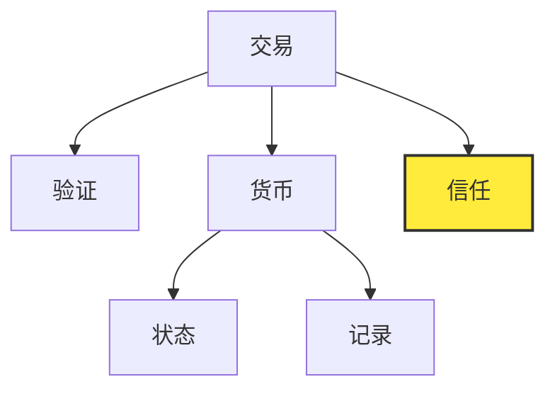
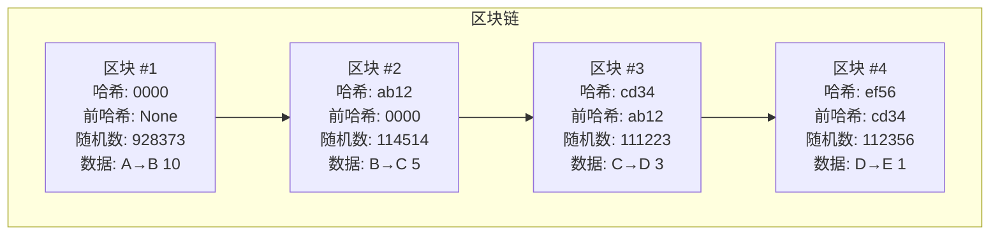
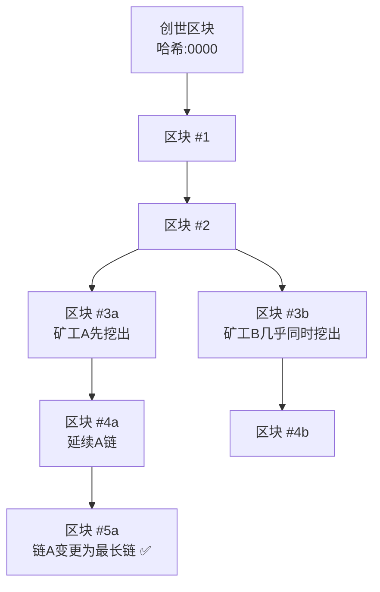

# BlockTraveller

1. 学习区块链的底层技术，并从零开始构建
2. 使用不同语言实现区块链，正好可以学习一下其他的语言

# Quick overview of BlockChain

### 交易与“双花”

区块链所适用的场景是**人的财产数字化**，人类社会运作离不开交易，我们每天的经济活动，无论是付款，转账还是资产管理，本质上都是围绕“交易”展开。

纵观人类历史，交易的形式经历了几次重大变革：以物易物 -> 实体货币 -> 电子货币。

现在我们代入一个场景，小明向小红支付1元，从小红手里购买一个苹果：
* 如果小明使用现金，那么交易执行后，小红获得了1元实体货币，小明失去了1元实体货币，这很好理解。
* 当货币电子化，就引发了一个问题：数字信息天然可复制，数字货币当然也可以被复制并被多次使用。小明向小红支付了1元电子货币，但他复制了这1元电子货币，下次也可以进行支付，这就是“双花”问题（Double Spending），也叫双重支付问题。

### 中心化 与 去中心化

> 上面我们讲到，电子货币引发了“双花”问题，那么如何解决这个问题？

一种方法是，在小明，小红和其他所有网络支付参与者之间，设立一个共同信任的第三方机构（比如银行），这个第三方机构负责管理一个**中心化**的账本，用于跟踪和验证网络中的所有交易。

上面的场景就变成了：买方 -> 银行 -> 卖方
1. 小明向电子银行发起“支付1元电子货币给小红”的申请
2. 银行**验证**交易，例如：小明是否拥有这1元？发起交易的人是否真的是小明？...
3. 验证通过，银行执行并**记录**本次交易，小明失去1元电子货币，小红获得1元电子货币

另一种方式，就是2008年的一份 由使用中本聪（Satoshi Nakamoto）这一名字的匿名人士/团体 发布的一篇名为[Bitcoin: A Peer-to-Peer Electronic Cash System](https://bitcoin.org/bitcoin.pdf)的白皮书，在这里描述了如何构建一个点对点的电子现金系统，该系统允许网络中的两位用户直接发起在线支付，而**无需经过中心化机构**。

为解决“双花”的问题，中本聪提出了一种“公共账本”的概念，这个账本用来追踪网络中的所有交易，参与到这个交易网络中的所有用户共同维护这个账本。

由此，上面的场景就变成了：买方 -> 公共账本（区块链网络） -> 卖方，我们在这里简单阐述一下交易的过程，在下面的“区块链”章节会详细介绍相关概念。
1. 小明**创建**了“小明向小红支付1元电子货币”的交易
2. 小明将创建的交易**广播**到区块链网络
3. 区块链网络确认交易：例如，创建这个交易的人是否真的是小明？根据公共账本的记载，小明是否真的拥有这1元？...
4. 验证通过，公共账本上添加了小明创建的这个交易，如果后续小明继续交易，这条交易将记录小明失去了一元电子货币。

> 解决电子支付“双花”问题的核心，在于“信任”，而 中心化 与 去中心化 之间的区别，在于“信任”的实现方式

在现实生活中，我们的的交易都是以“中心化”的方式运作的，要想理解“去中心化”，我们自底向上，先理解我们身边的中心化，再来理解去中心化。

接下来，我们拆解一下交易与货币的概念，然后从这些“原子概念”出发：



* 交易由货币与验证组成
    * 验证的核心逻辑是，我验证你的状态是否满足这次交易，说人话就是你的余额够不够，这一点“中心化”与“去中心化”是一样的。
    * 货币则是交易的主体，它由三个核心概念组成：
        * 状态：指的是当前某个账户上拥有多少货币，即余额，通常用来确认交易是否可以发生（即余额够不够支付）。
        * 记录：指的是当前某个账户上的余额是怎么来的，经历了哪些交易路径，记录不仅是“交易历史”，更是“合法性证明链”。
    * **信任**：确认状态或记录有效，因为系统/法律/共识机制支持它。【比如实体货币里的假币就是未经信任的，非法交易（记录）所得的余额（状态）就是未经信任的】


在中心化体系中：
* **状态由可信的权威实体直接维护**（例如银行数据库中记账余额）。
* 记录是由内部维护的、用户可查看自己的记录，信任机构可审查所有的记录。
* 用户信任该机构不会作恶，即可认定状态/记录为真。

而在去中心化的体系中：
* 状态是从头到尾梳理记录，计算得出的。
* 记录，就是公共账本，**由参与到这个交易网络的所有人共同维护**。
* 用户信任的是公共账本本身，它由所有人维护，有验证机制，公开透明，任何人可审查，最重要的是，所有人对账本的操作只能是添加交易，篡改、删除都不可能。

由此可见，中心化 与 去中心化 之间的的区别在于信任：
* 在中心化的体系下，信任主体是状态，记录是辅助审查的手段，状态是直接存储的。
* 去中心化的体系下，信任主体是记录，通过重放交易记录，计算出状态，记录是直接存储的。

至于信任如何实现？
* 中心化的场景下，可以由法律、公共机构监管那些中心机构不会随意篡改用户的数据，通过系统代码审查等方式保证信任。
* 但去中心化的场景下，信任只能由代码来实现，这就是下面章节介绍的区块链，它由几个核心的功能，来保证信任。

### 区块链需求

中本聪提出的“公共账本”的概念，它的实现就是区块链，它的大致数据结构如下图所示：



交易信息被称作区块，由前哈希字段进行连接，有点像单向链表。

区块链如何保证信任，或者说，它如何保证信息不被篡改？
1. 去中心化：账本是分布式的，账本会被复制到多台计算机上，而不是存储在中央服务器，任何连接到该网络的计算机都可以下载完整的区块链副本。
2. 加密：加密用于验证身份，是信任的技术基础
3. 不可变：区块链只能以追加的方式更改，换句话说，交易只能添加到区块链中，已经存在于区块链中的交易信息，无法被删除或者篡改。
4. 共识机制：这个是区块链的信任关键，试想一个问题：在没有中心机构协调的情况下，如何让全球成千上万个互不信任的节点对同一个区块链账本达成一致？
    * 工作量证明：它通常是一个加密难题（我们可以将它理解为一个比较难的数学题），只有解答出这个加密难题，交易才会被承认（至于为什么要设计数学题，下面会详细讲）
    * 最长链原则：整个网络中，哪个区块链的长度最长，就被认定为标准，这种竞争和最长链原则确保了网络中的所有节点最终会收敛到同一条权威的区块链历史记录上，从而实现了去中心化的共识。

### 区块链实现

区块链的实现基于几种技术：非对称加密，哈希算法，网络广播

接下来我们深入区块链的技术细节，看它究竟是如何实现的：

---

> [非对称加密](https://en.wikipedia.org/wiki/Public-key_cryptography)

非对称加密的特点事：公钥加密的内容，只有私钥可以解密，公钥可以广泛传播，私钥只有其所有者知道，基于这种特性，就实现了两种功能：
1. 身份验证
2. 信息加密

简单来说，我们拿BTC举个例子，小明要向小红支付1BTC，看看创建一个比特币交易，需要经历哪些步骤：

1. 首先要准备好一对公私钥，私钥小明自己留好，公钥广播到网络中人尽皆知。
2. 创建好交易信息，内容为：“小明向小红支付1BTC”。
3. 使用自己的私钥，为刚才创建好的交易信息签名（证明是小明**本人**要向小红支付1BTC），然后将交易信息广播到网络中
4. 网络中的“矿工”（就是解答加密难题的人）使用，小明公开的公钥，验证小明广播出来的签名信息
5. 网络中的“矿工”解答加密难题，将交易信息与加密难题的答案一起，添加到区块链中，并向网络中广播。
6. 一段时间后，网络中的其他节点确认此交易，至此，交易确认。

从上面的步骤可以看出，交易确认需要两个关键因素：
* 确认是小明本人发起的交易，而非他人伪造。
* 网络中的“矿工”们，解答出了加密难题，完成了工作量的证明。

因此，私钥一定要保存好，它是你身份的证明，一旦私钥被别人知道了，他们就可以随意的以你的身份发起交易。

上面这些只是笼统的描述比特币交易时的签名流程，详细内容请参考：
1. https://en.bitcoin.it/wiki/Invoice_address
2. https://en.bitcoin.it/wiki/Technical_background_of_version_1_Bitcoin_addresses

---

> [哈希算法](https://en.wikipedia.org/wiki/Hash_function)与工作量证明（挖矿）

上面的“签名”讲解部分，我们提到了“矿工”与“加密难题”，接下来我们就详细了解它是什么。

要理解区块链中的加密难题，我们先从哈希函数开始，哈希函数是指：任何能将任意大小的数据，转换为固定大小的数据的函数。哈希函数的返回值被称作哈希值，另外很重要的一点，由原始值（哈希函数的输入）计算出哈希值（哈希函数的输出）非常容易，但是反过来，通过哈希值推算出原始值，是非常困难的，只能用穷举法一个一个试，又因为原始值的长度，内容都随意，因此几乎不可能倒推。

基于这种特性，就实现了两种功能：
1. 确认工作量证明
2. 保证信息不可篡改（被篡改了很快就能检查出来）

我们还拿比特币举例，所有比特币交易都分组存储在称为区块的文件中。比特币每10分钟添加一个新的交易信息区块。一旦新区块添加到区块链，它就不可篡改，无法删除或修改。（一旦交易信息改动，哈希值就发生了变化）。

网络中有一组特殊的参与者，称为“矿工”（连接到区块链的计算机），负责创建新的交易区块。矿工必须使用交易发送者的公钥对每笔交易进行身份验证（也就是上面讲的非对称加密算法），确认发送者拥有足够的余额（通过区块链中记录的交易信息推导出余额）来处理请求的交易，并将交易添加到区块中。

矿工可以完全自由地选择将哪些交易添加到区块中，因此发送者需要支付“交易费”来激励矿工将其交易信息添加到区块中。

一个区块要想被区块链接受，就需要被“挖矿”（解答加密难题）。如果挖出的区块（加密难题的答案）被区块链接受，矿工将获得比特币奖励。（比特币奖励的存在，就是要让网络参与者乐意成为矿工，为维护整个区块链信息做出贡献，要不然谁会用爱发电呢？）

到此，我们解释了矿工是什么，接下来解释加密难题，为什么加密难题会保证整个区块链上记录的信息安全可信。

首先，加密难题需要满足如下要求：
1. 这个加密难题很难解答，需要付出时间与计算机算力。
2. 这个加密难题的结果很容易被验证，整个加密网络上的所有人都可以轻松的验证。

有一句话总结的很到位(PoW: Proof of Work, 工作量证明)：
```markdown
The goal of PoW is to discover a number which solves a problem.
The number must be difficult to find but easy to verify—computationally speaking—by anyone on the network.
This is the core idea behind Proof of Work.

-- from [https://hackernoon.com/learn-blockchains-by-building-one-117428612f46]
```

还拿比特币举例，比特币使用一种名为[SHA-256](https://en.wikipedia.org/wiki/Secure_Hash_Algorithms)的加密哈希函数，比特币网络的加密难题是（这是一个举例说明，加密难题是可以调整的）：要求将当前区块上的数据，通过SHA-256计算后得到的哈希值，其前四位必须是`0000`。

但是，哈希函数的固定输入产生固定输出，怎么才能计算出前四位必须是`0000`的哈希值呢？答案就是随机数（nonce），这个随机数是一个任意数字，通过改变随机数这个变量，再加上区块链数据这个常量，一起计算出哈希值。通过不断尝试不同的随机数，寻找那个可以让哈希值满足了比特币网络要求的随机数。

当然，这个答案也很好验证，只要将当前区块的数据，加上找到随机数，使用SHA-256算法进行计算，就可以得到结果。

加密难题，实际上就是寻找随机数，运气好，一下就找到，运气不好，电脑累冒烟了都找不到；但总体来说，它有一个概率，这个概率的期望证明了你的工作量。

---

> 区块链的“链”

区块链的信任，在于区块链的完整性，我们前面绘制了区块链的示意图，可以看到它们是通过一个名为`prev_hash`的属性连接到一起的，当前块的`prev_hash`存储前一个块的hash值，这样，区块就组织成了一个链条结构。

更进一步，每个区块的哈希值是根据它自身的全部内容计算的，其中也包括 `prev_hash` 这一字段。也就是说，一个区块的哈希值不仅受其自身数据影响，还隐含地依赖于前一个区块的哈希值，进而依赖于整个链。

因此，一旦任意区块的内容被篡改，该区块的哈希值就会发生变化，导致它之后所有区块中记录的 `prev_hash` 与实际不符，从而引发一系列连锁错误。这条链在技术上仍然存在，但在网络中将被认定为非法，信任也随之丧失。

这个“链”的结构与hash算法，共同赋予了区块链不可篡改的特性。

---

> 共识机制：最长链原则

我们已经知道，区块链通过“链”的结构，使得所有交易记录彼此连接在一起，任何数据被改动，都会引发后续的连锁错误，从而无法获得网络的信任。

但问题来了：网络中有成千上万的节点，谁来决定“哪一条链才是真正可信的那一条”？

这就是**共识机制**要解决的问题：当网络中出现多条不同的链时（比如两个矿工几乎同时挖出新区块，导致链出现分叉），我们需要一个统一的规则，让所有人最终达成一致，选择同一条链继续延伸。



如果两个矿工几乎同时解决了一个区块，那么网络中将出现两个不同的区块链，我们需要等待下一个区块来解决冲突：
* 一些矿工会选择在区块链 1 上挖矿，而另一些矿工则选择在区块链 2 上挖矿。
* 第一个找到新区块的矿工将解决冲突。如果新区块是在区块链 1 之上挖出的，那么区块链 2 就会失效，前一个区块的奖励将归属于区块链 1 的矿工，而属于区块链 2 但未添加到区块链的交易将返回到交易池，并添加到下一个区块中。简而言之，如果区块链上发生冲突，则最长链获胜。

值得注意的是，所谓“最长链”，不是指区块数量最多，而是指**全网计算工作量最多**、**累计难度最大的那一条链**。换句话说，哪条链是大家花最多时间、最多算力挖出来的，那就是全网最认可的一条链。

在大多数时候，工作量最多的链也正好是区块数最多的那条链，因为比特币网络每个区块的挖矿难度基本是一样的。

但是，为了防止被攻击或欺骗，这个规则设计得比“比长度”更严格一些。比如，在一些山寨币或非标准实现中，攻击者可能故意构造一条分叉链，让它的区块数量看起来很多，但每个区块都设置得很容易挖（难度很低），这样就“用低成本堆出一条长链”。

如果共识机制只看链的长度，就会把这种“偷工减料”的链当成主链，反而容易被恶意替代。比特币的规则就避免了这个问题：它不看谁区块多，而是看**谁花的算力多、做的工作多**。

所以，我们说“最长链”原则，其实更准确地说，是“**最重链**”原则——**谁付出的工作量最多，谁赢得共识**。

---

> 确保信任: 延迟确认，信任累积

前面我们讲到，区块链上的每一笔交易都要被打包进新区块，经过挖矿确认后，才算真正“写进”区块链。但这并不意味着，只要交易进入了某个区块，就绝对安全了。

逻辑也是有漏洞的，我们来看一些骚操作，这里我们拿BTC举例

1. 小明（黑化版）目前钱包里只有1BTC，它**同时**创建两条交易信息：小明支付小红1BTC、小明支付小光1BTC
    * 一边的矿工们基于当前的区块链信息，确认了小明有1BTC，可以支付给小红1BTC，但交易还没确认并上链
    * 另一边的矿工们同样确认小明可以支付给小光1BTC，但交易还没确认上链。
    * 一旦一方的交易确认了，通过最长链原则，另一方的交易就会回到交易池，等待下一次的打包，这次，小明的1BTC已经支付出去了，另一方的交易就失败了，这就是“1块当2块花”。

2. 小明（黑化聪明版），小明有俩钱包（A与B），还是小明向小红支付1BTC，他**先私下挖出一个的区块，内容是钱包A向钱包B支付1BTC**，但不立即广播出去，而是先发布“钱包A向小红支付1BTC”，等待矿工们确认。如果小明能成功广播出他事先准备好的区块，并让它成为主链，那么网络就会选择这条链，“左手倒右手的行为”被确认，而与小红的交易会被视为无效。这样，小明表面上付款了，实际上什么都没付。

上面这两种行为，就是利用共识机制的漏洞，发起的“双花”攻击。

比特币网络解决这个问题的办法，等待这笔交易之后的**6个区块确认**再视为真正完成交易。

因此，区块链的信任不是瞬间达成的，而是通过**连续叠加的区块，逐步累积的信任过程**。你等待的越久，这笔交易被“推翻”的概率就越低。

在当前的比特币网络中，**等待 6 个确认块，几乎可以认为这笔交易已经不可能被逆转**。


### 区块链的信任保证

上面我们讲到，区块链采用了种种技术，保证了信任，这些技术的组合与设计，究竟能将信任贯彻到何种地步，或者说，伪造一份交易（“双花”）的难度如何？

1. 通过网络延迟，伪造交易的行为，延迟确认已经判它死刑。
2. 由于区块链是共识机制，如果想要“统治”整个区块链网络，只需要付出整个区块链网络51%的算力就好了，但像比特币这种规模的区块链网络，算力庞大，几乎是不可能的。

### 写在最后

总结一下，区块链实际上是由“三元”组成：交易处理，区块计算，共识机制

| 模块       | 简要说明                                       |
| -------|------------------------------------------ |
| 交易处理  | 交易的创建、签名、验证、广播与接收，确保交易本身真实有效。                           |
| 区块与存储 |  区块结构设计、状态存储（如 UTXO / Account Model）、Merkle 树等，确保数据有序、完整、可验证。  |
| 共识机制 |   节点如何就“哪条链是真的”达成一致，比如 PoW、PoS、DPoS 等        |

这三点共同维护了一个可信的公共账本，记录网络中的每一笔交易。

正是这三元的不同实现方式的组合，成就了如今web3百花齐放的生态。就像RGB三原色可以调出无穷无尽的色彩，不同的技术路线也描绘出多样化的区块链生态（比特币、以太坊...）。

当然，核心目标只有一个，那就是去中心化，将信任赋予集体，少数服从多数。只不过条条大路通罗马，更高效、更安全、更为大众所认可的那条道路便可成为主流，获得更广泛的使用。

# How to join this repository

1. 整体架构

2. 功能列表

3. 选择一门你喜欢的语言，进入这个语言的目录（比如python语言的实现，就去python-impl），然后阅读这个目录下的README.md文件。
