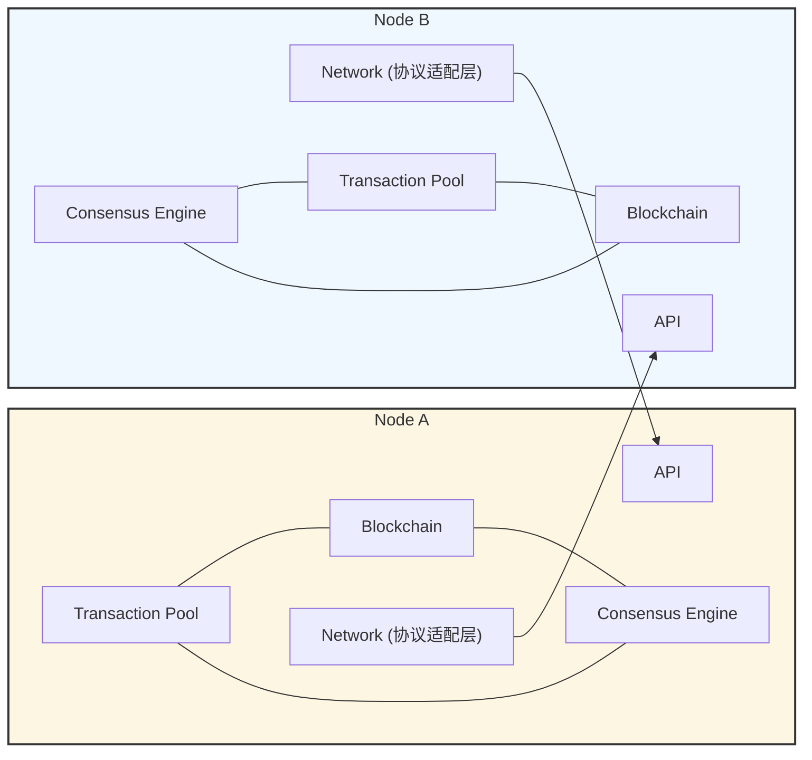

# Python BlockChain Implementation

Node是系统入口，管理core中的实例生命周期，Node之间相互隔离

* Node
  * core
  * API
  * network

```mermaid
graph LR
    subgraph NodeA["Node A"]
        direction TB
        style NodeA fill:#fdf6e3,stroke:#333,stroke-width:2px,rounded

        TxPoolA["Transaction Pool"]
        BlockchainA["Blockchain"]
        ConsensusA["Consensus Engine"]
        
        APIA["API"]
        NetworkA["Network (协议适配层)"]

        TxPoolA --- BlockchainA --- ConsensusA --- TxPoolA
    end

    subgraph NodeB["Node B"]
        direction TB
        style NodeB fill:#f0f8ff,stroke:#333,stroke-width:2px,rounded
    
        APIB["API"]
        NetworkB["Network (协议适配层)"]
        
        ConsensusB["Consensus Engine"]
        BlockchainB["Blockchain"]
        TxPoolB["Transaction Pool"]
        
        TxPoolB --- BlockchainB --- ConsensusB --- TxPoolB
    end

    NetworkA --> APIB
    NetworkB --> APIA
```
